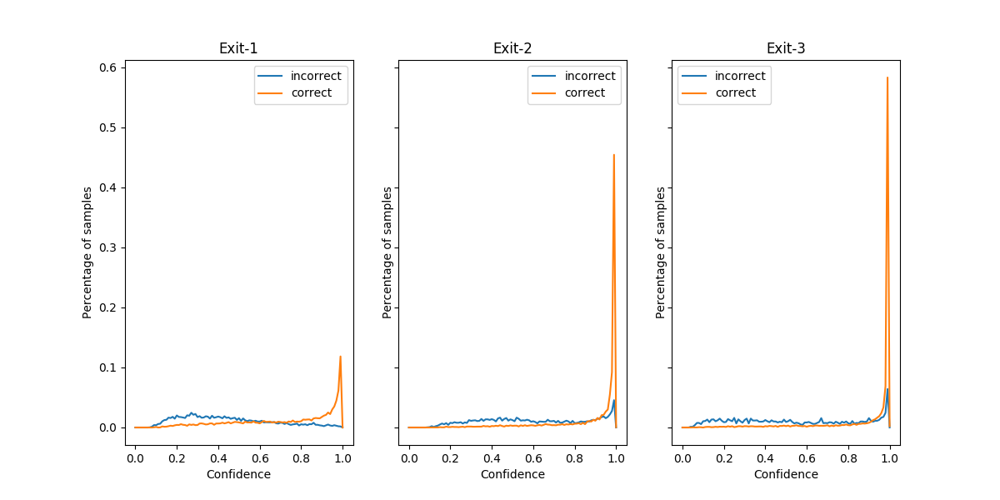

| Setting   | exit-1 | exit-2 | exit-3 | Adaptive Acc | Increased Acc |
| --------- | ------ | ------ | ------ | ------------ | ------------- |
| random    |        |        |        |              |               |
|           | 0.331  | 0.338  | 0.331  | 66.390       |               |
| 0.5       | 0.605  | 0.287  | 0.109  | 61.200       |               |
| 0.6       | 0.498  | 0.331  | 0.171  | 63.720       |               |
| 0.7       | 0.406  | 0.360  | 0.234  | 64.570       |               |
| 0.8       | 0.330  | 0.353  | 0.317  | 66.280       |               |
| 0.9       | 0.235  | 0.357  | 0.408  | 67.850       |               |
| 0.95      | 0.164  | 0.340  | 0.496  | 69.590       |               |
| threshold |        |        |        |              |               |
| 0.5       | 0.600  | 0.291  | 0.109  | 66.870       | 5.67          |
| 0.6       | 0.500  | 0.329  | 0.171  | 69.660       | 5.94          |
| 0.7       | 0.411  | 0.354  | 0.235  | 71.700       | 7.13          |
| 0.8       | 0.332  | 0.359  | 0.308  | 73.250       | 6.97          |
| 0.9       | 0.234  | 0.360  | 0.406  | 74.180       | 6.33          |
| 0.95      | 0.167  | 0.341  | 0.492  | 74.670       | 5.08          |

For the table shown in the meeting from the last time, I calculate the increased accuracy for each threshold setting. **It can be seen in the last column that as the threshold increases, the increased accuracy will first increase and then decrease.** I think it satisifies our expection. 

Furthermore, I did some other experiments.

For different classifiers, I draw the proportion of samples corresponding to different thresholds. The figure is shown below. The samples that are correctly classified tend to have higher confidence, which is not very surprising. Interestingly, however, most incorrect input samples also have high confidence, especially for classifier 2 and 3.  **Therefore, it is difficult to tell whether a sample with high confidence is correctly classified or not.**

I also compute the number of samples for each combination. For example, "001" means that the first and second classifiers fail to classify the sample correctly, while the third sample classify the input sample correctly. We think the samples in "111" are the easiest, those in "011" are the second easiest, those in "001" are the third easiest, and those in "000" are the hardest.

| combination | number of samples |
| ----------- | ----------------- |
| 000         | 1912              |
| 001         | 266               |
| 010         | 195               |
| 011         | 122               |
| 100         | 740               |
| 101         | 246               |
| 110         | 1589              |
| 111         | 4930              |

I draw some figures for distributions of conidence on some combinations.  The second and third classifiers give high confidence to most of input samples, regardless of difficulty. **It is difficult ot judge whether a sample is diiffcult simply by confidence**, since the confidence distributions of easy and hard samples are irregular.

111:

011:

001:

000:

In particular, we draw a distribution for the 100 combination. If these samples tend to have high confidence at the first classifier, then it might be why the threshold strategy is always 5% more accurate than the corresponding random strategy.

100:

010:

Proportion of samples that are classified correctly by threshold, but not by random:

For example, "0.0233" for 0.5 and 0.95 means that the same 2.33% of testing samples are classified correctly by threshold strategy, but not by random.

|      | 0.5  | 0.6  | 0.7  | 0.8  | 0.9  | 0.95 |
| ---- | ---- | ---- | ---- | ---- | ---- | ---- |
| 0.5|0.099|0.0556|0.0492|0.0396|0.0312|0.0233|
| 0.6|0.0556|0.1098|0.0547|0.0436|0.0347|0.0283|
| 0.7|0.0492|0.0547|0.1082|0.047|0.0408|0.0279|
| 0.8|0.0396|0.0436|0.047|0.0999|0.0397|0.0289|
| 0.9|0.0312|0.0347|0.0408|0.0397|0.09|0.0298|
| 0.95|0.0233|0.0283|0.0279|0.0289|0.0298|0.0696|

